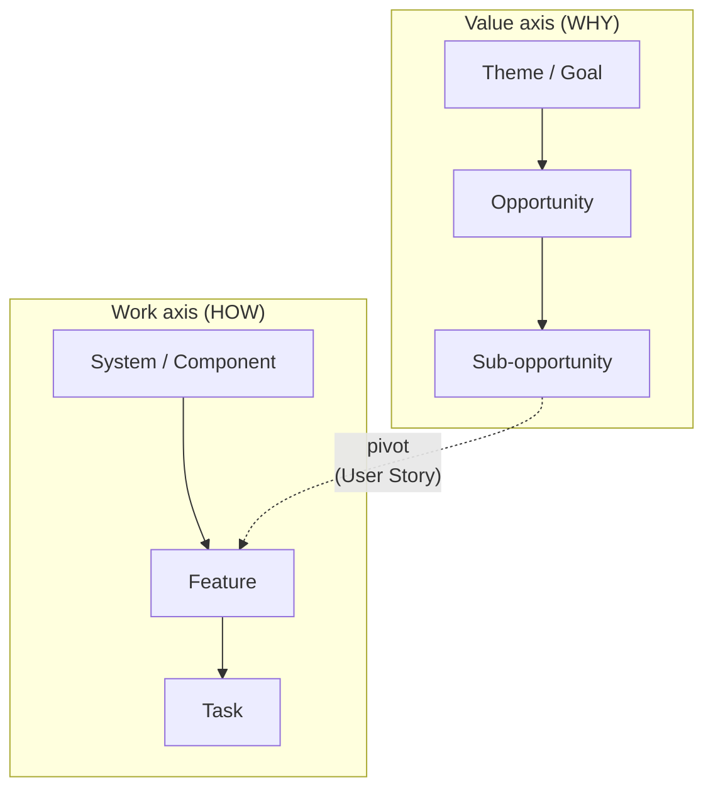
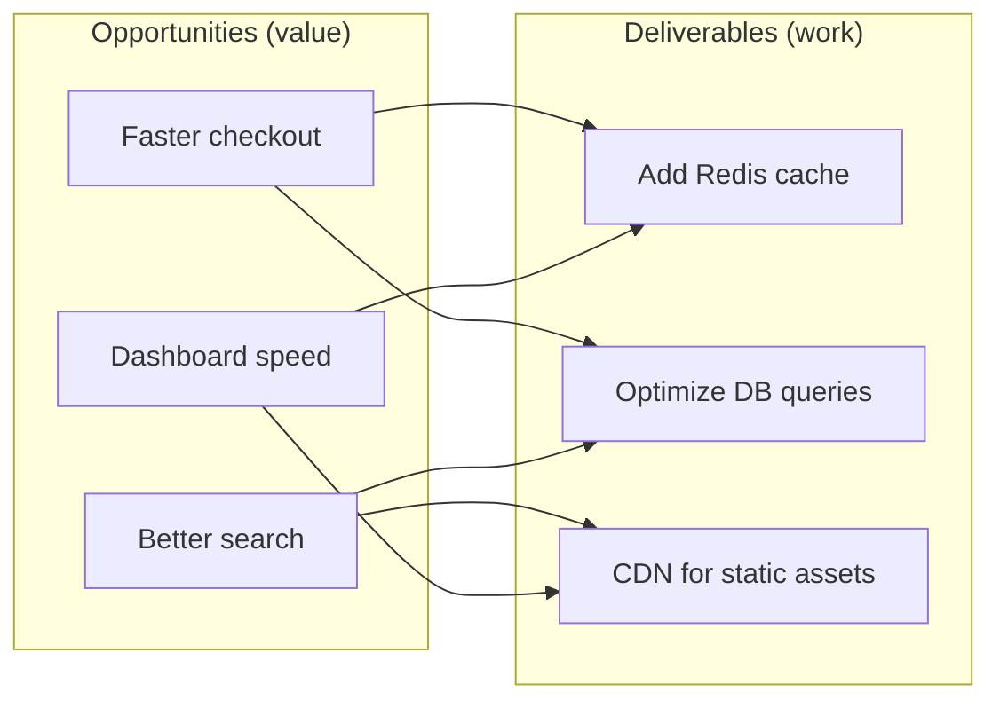

# Upstream — Product Concept

> A lean planning tool for product owners, covering the workflow *before* the sprint board.

## Problem

Every agile tool models the production pipeline (Todo → Doing → Done) and treats everything upstream as an undifferentiated "backlog." Product owners are left to manage ideation, clarification, and validation in their heads, spreadsheets, Confluence pages, and Miro boards — none of which model the *flow* of an idea from inception to "ready for sprint."

Developers got Kanban boards 15 years ago. Product owners got a text editor and good luck.

### Symptoms

- POs discover opportunities are 3× bigger than assumed during sprint planning — too late to rescope
- No visibility into where ideas are stuck (12 items in "clarifying," zero validated)
- Validation is skipped because nothing structurally enforces it — ideas go straight from "someone asked for this" to the backlog
- In R&D, half the pipeline is supply-driven ("we *can* build this") but there's no structural gate for "but *should* we?" — technically exciting ideas skip validation by default
- The value → work decomposition happens implicitly, losing the link between business goals and dev work
- Prioritization is gut feel because value, risk, and effort aren't captured with the same rigor

## Foundations

### The upstream gap

The work before a ticket enters a sprint is where most value decisions happen, but it's invisible in current tooling. Making that flow explicit — with WIP limits, stage gates, and structured estimation — lets POs catch bad bets early instead of at sprint planning.

### The false hierarchy

Conventional agile tools pretend there's a single decomposition hierarchy: Epic → Story → Task. This is false. There are two orthogonal decomposition axes forced into one linear chain:



A user story sits at the **pivot point** between these two trees. It's the last value-level entity and the first work-level entity. Jira hides this pivot by treating everything as the same ticket type with different labels.

Upstream makes the pivot explicit:

- **Everything above the pivot** (value decomposition) lives in Upstream, owned by the PO: *why* are we doing this? Is it worth it? What's the smallest valuable slice?
- **Everything below the pivot** (work decomposition) lives in the sprint tool, owned by the dev team: *how* do we build it? What are the tasks?
- **The Decompose stage is the pivot itself** — where value-framed opportunities get *translated* into deliverables. This is not just "splitting a big thing into small things." It's a change of frame, from "what's valuable" to "what do we build."

### The many-to-many mapping

The relationship between the two axes is not a tree — it's a **graph**.



- One opportunity may need multiple deliverables to realize.
- One deliverable may serve multiple opportunities (partially or fully).
- A deliverable can *partially* cover an opportunity — delivering some of its value but not all.

Jira forces a tree (one parent epic per story), which either loses the multi-parent links or forces artificial duplication. The false hierarchy isn't just about two axes — it's that the mapping between them is many-to-many, not hierarchical at all.

Upstream must model this as a **link graph**, not a parent-child tree. This lets the PO answer questions that current tools can't:

- "Which opportunities are at risk because deliverable X was descoped?"
- "Is this deliverable still worth building if opportunity Y is killed?"
- "How much of this opportunity's value is already covered by existing deliverables?"

### Influence relationships (inspired by ArchiMate)

ArchiMate's motivation layer models goals, assessments, stakeholders, and *realization relationships* between them — structurally similar to our value axis, three lenses, people links, and opportunity→deliverable graph. The key idea we borrow is that realization links carry **polarity and weight**:

- Redis cache **positively** serves "Faster checkout" (strong)
- Redis cache **positively** serves "Dashboard speed" (moderate)
- Redis cache **negatively** impacts "Simplify infrastructure" (weak — adds a new component)

A deliverable can *hurt* one opportunity while serving another. Without polarity, the PO can't see trade-offs in the graph — the cache looks like a pure win because all links are positive. With polarity, building the cache visibly trades off against infrastructure simplification. This is especially common in R&D, where technical choices have cross-cutting consequences.

MVP links are binary (connected or not). Polarity and weight are a v2 enrichment of the same graph primitive — just adding `{polarity, weight}` to each edge. No new entity type, no new UI concept. The graph view gains color-coded edges: green for serves, red for hinders. Opposing polarities on the same deliverable surface **contradictions** (TRIZ) — not just trade-offs to accept, but creative tensions where the best engineering solutions tend to emerge.

## Lean Pipeline

An opinionated, hierarchical state model. Each macro-stage has an internal todo → doing → done lifecycle that activates when someone picks up the work. This mirrors the diverge → converge rhythm of design thinking: each stage opens with exploration (collect options, perspectives, inputs), moves through active work, and closes with a decision.

### Stages as thinking modes

Inspired by De Bono's separation principle: don't mix thinking modes simultaneously. When creative and critical thinking happen at the same time, critical always wins — ideas die before they're formed. Each pipeline stage enforces a dominant thinking mode:

| Stage | Thinking mode | What belongs here | What does NOT belong here |
|---|---|---|---|
| **Explore** | Open | "What if..." — explore, combine, imagine | Criticism, estimates, go/no-go |
| **Sketch** | Focused | Facts, constraints, who's affected, what "done" means | Judgment, solution design |
| **Validate** | Evaluative | Testing assumptions against evidence | New ideas (those go back to Explore) |
| **Decompose** | Structural | Splitting, sizing, mapping to deliverables | Revisiting whether we should build it |
| **Export** | Mechanical | Push to sprint tool | — |

Contributors opening a card know *what kind of thought is invited* by the stage it's in.

### Three perspectives as a dimension, not a stage

The three IDEO lenses (desirability, feasibility, viability) are not specific to Validate — they're a **second dimension** that runs across the entire pipeline. What changes is the fidelity:

| | Desirability (user) | Feasibility (tech) | Viability (business) |
|---|---|---|---|
| **Explore** | "Someone might want this" | "Seems possible" | "Fits our area" |
| **Sketch** | "Here's who and why" | "Here are the constraints" | "Strategy alignment checked" |
| **Validate** | "We tested — they do/don't" | "Spike confirmed/denied" | "Business case holds/fails" |
| **Decompose** | "This deliverable serves that need" | "Sized and estimated" | "Worth the cost" |

The pipeline is the **flow axis** (left to right). The perspectives are the **viewpoint axis** (who's weighing in). Every card lives in a 2D space: stage × perspective.

This resolves a key tension: Validate doesn't have "mixed hats." *Every* stage has three perspectives at different fidelities. The stage's thinking mode (open, focused, evaluative, structural) applies to all three perspectives. Explore invites open-desirability ("what if users could..."), open-feasibility ("what if we used..."), and open-viability ("what if we positioned this as...") simultaneously — because all three are open thinking.

**Validated by KTH Innovation Readiness Level.** KTH's IRL framework independently identified the same three core dimensions for assessing innovation maturity: Customer Readiness Level (CRL) = Desirability, Technology Readiness Level (TRL) = Feasibility, Business Model Readiness Level (BRL) = Viability. Their 9-level scale per dimension maps cleanly onto our pipeline fidelity: levels 1–2 ≈ Explore, 3–4 ≈ Sketch, 5–6 ≈ Validate, 7–9 ≈ beyond Upstream (Produce/Scale). KTH also defines three additional dimensions — IPR Readiness (IPRL), Team Readiness (TMRL), and Funding Readiness (FRL) — which are not universal but critical for specific contexts (IPRL for R&D orgs, TMRL for early-stage teams, FRL for funded ventures). This suggests the perspective axis should be **extensible**: three built-in (desirability, feasibility, viability), with custom perspectives addable per org. KTH's BRL also explicitly integrates environmental and social sustainability from level 4 onward — a viability enrichment worth keeping on the radar.

**People links gain perspective ownership.** A person isn't just "involved in this card" — they own a perspective: the tech lead owns feasibility across cards, the designer owns desirability, the PO owns viability. The "My items" filter can show: "cards where the feasibility perspective needs me."

**Stage expansion is per team structure.** For a solo PO (Jordan), the three perspectives are fields on the card. For an R&D org (Alex) where different people own different perspectives, each stage can expand into perspective swim lanes on the board. Same data model, different visual density — a board configuration choice, not an architectural decision.

Internal flow per stage:

| Stage | Owner | Internal flow | Output |
|---|---|---|---|
| **Explore** | Anyone → PO | Capture → Discover → Shaped | A shaped idea with rough scope |
| **Sketch** | PO + stakeholders | Draft → Discuss → Defined | Acceptance criteria, constraints, stakeholder sign-off |
| **Validate** | PO + team/users | Hypothesize → Test → Decided | Go/no-go with evidence per perspective |
| **Decompose** | PO | Map → Split → Estimated | Sized deliverables ready for sprint planning |
| **Export** | PO | — | Deliverables pushed to Jira / Linear / CSV |

### Design principles

- **Opinionated by default** — rigid pipeline; easier to relax later than to tighten
- **WIP limits per stage** — columns change color when overloaded. The PO feels the pressure without configuring anything.
- **Cards age visibly** — time-in-stage drives a subtle visual shift (fresh → amber → red). Stale ideas are impossible to ignore without needing a "neglected items" report.
- **Blocked is a first-class state** — an opportunity can be marked "waiting on: [person]". The blocker is almost always someone who doesn't know they're blocking. Naming *who* (not just what) turns four separate stalls into one conversation. Blocked items look different and don't count toward healthy WIP.
- **Unplanned work is tagged, not banned** — urgent requests enter the pipeline with a distinct visual marker. The PO sees displacement happening in real time: "I took on 3 unplanned items this week and my Validate column didn't move."
- **Opportunities have an origin type and must name both problem and solution by Sketch exit** — where the opportunity comes from shapes how it enters, but **every opportunity needs both halves before it can progress** (Osborn-Parnes problem-finding):
  - **Demand** — a problem or need ("users complain about X"). Arrives with a problem, must discover a solution direction by Sketch exit.
  - **Supply** — a capability or technology ("we can now do Y"). Arrives with a solution, must discover the problem it solves by Sketch exit. This prevents supply-side ideas from sailing through as solutions without a problem.
  - **Incident** — an urgent disruption ("production is down"). The only unplanned type.
  - **Debt** — accumulated evidence from bugs, deferred concerns, or discovered degradation ("our auth layer has caused 5 bugs in 3 months"). Arrives with a pattern of symptoms, must discover whether the pattern justifies systemic action. See [Debt and bugs](#debt-and-bugs).
  
  Seeing the ratio (60% demand, 20% supply, 10% debt, 10% incidents) is itself a useful signal.
- **Skipping stages is visible, not impossible** — a conscious choice, not the default
- **Feedback flows forward as new items** — a production discovery enters Explore, not as reverse flow (that gets messy)
- **The board looks wrong when things are wrong** — no dashboards, no metrics panels, no flow analytics. The pipeline's visual state *is* the diagnostic. A healthy board is obvious. An unhealthy board is obvious. The PO doesn't need a framework to read it.
- **The funnel should narrow** — many ideas enter, few survive. A small visual at the top shows the shape: "47 → 12 → 5 → 3" is a healthy funnel. "47 → 45 → 44 → 43" means you're not saying no. The purpose of the upstream pipeline is to *reduce* what reaches sprint planning, not just to organize it.
- **PO curates, contributors update, everyone sees** — the PO moves cards and makes decisions; contributors update their own fields. Everyone sees the full board. Details in [Contribution model](#contribution-model).
- **Maintain is out of scope, but connected** — bugs and individual debt items live in the sprint tool. What flows back into Upstream is the *pattern*: accumulated debt that justifies a new opportunity. See [Debt and bugs](#debt-and-bugs).

## Entity Model

Two entity types, reflecting the two decomposition axes:

| Entity | Axis | Lives in | Lifecycle |
|---|---|---|---|
| **Opportunity** | Value (why) | Explore → Sketch → Validate → Decompose | Business-level; has value, risk, stakeholders, blockers, maturity level, and time-in-stage. Carries a **horizon** (delivery intent, e.g. "2026Q3" or "LATER") — separate from stage (confidence). Can decompose into sub-opportunities. |
| **Deliverable** | Work (how) | Decompose → Export | Dev-level; has T-shirt size, certainty (1–5), external dependencies. Further decomposition into tasks happens in the sprint tool. |

The Decompose stage is the **pivot** between axes (see [The false hierarchy](#the-false-hierarchy)). Relationships are many-to-many links, not a parent-child tree.

### Horizon vs. stage

An opportunity's **stage** reflects how thoroughly it's been validated (confidence: how sure are we?). Its **horizon** reflects when the PO intends to deliver it (intent: when do we aim?). These are independent dimensions:

- An opportunity at Explore with horizon Q2 is a **risky bet** — committed timeline, unvalidated idea
- An opportunity at Validate with horizon LATER is a **proven option** — validated but not yet prioritized for delivery

Horizons default to the current quarter (e.g. "2026Q2") but are freeform strings — teams can use "NOW / NEXT / LATER," fiscal quarters, or custom labels. The Roadmap view groups opportunities by horizon, giving stakeholders a delivery-intent view while the Opportunities view groups by triage urgency.

### Debt and bugs

**Debt** is what accumulates when concerns are noted but not resolved. It comes in three flavors, mirroring the three perspectives:

| Perspective | What concern looks like | What debt looks like |
|---|---|---|
| Feasibility | "We can build it, but the architecture is a shortcut" | **Technical debt** — fragile implementation, accumulated workarounds, degraded performance |
| Desirability | "Users can do it, but the experience is compromised" | **User debt** — UX workarounds, accessibility gaps, inconsistent patterns, missing edge cases |
| Viability | "It works commercially, but the model is incomplete" | **Business debt** — manual processes that should be automated, compliance gaps, pricing that doesn't scale |

Debt has two sources:

1. **Deferred** — explicit trade-offs captured as "uncertain" verdicts that shipped. The pipeline already has this data: every concern logged during Sketch or Validate is a potential debt item if the opportunity ships without resolving it. The verdict is the warning; the debt is the bill.
2. **Emergent** — discovered post-shipping. A library has security issues (technical). Users develop a workaround pattern nobody anticipated (user). A regulation changes (business). Emergent debt enters the system as new information, not as a deferred concern.

Individual debt items are not opportunities — they're **standing evidence** that accumulates weight. When a pattern emerges (5 bugs pointing to the same subsystem, 3 support tickets about the same UX workaround, a quarterly compliance review revealing gaps), the pattern can justify a new opportunity entering Explore with origin type "debt." The accumulated evidence travels with the opportunity as built-in context for the signal grid.

**Bugs are a fundamentally different entity.** They don't fit the opportunity model:

| | Opportunity | Bug |
|---|---|---|
| Question | "Should we do this?" | "How bad is this and how do we fix it?" |
| Assessment | Desirability × Feasibility × Viability | **Probability × Impact** (risk matrix) |
| Lifecycle | Explore → Sketch → Validate → Decompose | Report → Reproduce → Analyze → Fix → Verify |
| Value framing | Creating new value | **Restoring expected value** |
| Decision | "Is this worth pursuing?" | "How urgently and how thoroughly?" |

Bugs live in the sprint tool — that's their natural home. The lifecycle (triage → quick fix → proper fix) is a production concern. But the **bug → debt → opportunity loop** is Upstream's concern:

```
Bug → reveals → Debt → accumulates → Opportunity
         |                               |
    Sprint tool                       Upstream
  (fix the symptom)              (address the cause)
```

A single bug gets a hotfix in the sprint tool. Five bugs revealing the same root cause enter Upstream as a debt-driven opportunity with the bug reports as evidence. The quick fix → proper fix pattern is two decisions about the same defect: (1) triage by probability × impact → response urgency (sprint tool), and (2) does this reveal systemic debt that justifies an opportunity? (Upstream).

**Upstream's role is not to manage bugs or individual debt items.** It's to make the accumulation visible and give the PO structured evidence when the pattern justifies systemic action.

### Maturity

Large or uncertain opportunities don't march through the pipeline once — they spiral through Sketch → Validate multiple times at increasing fidelity. Rather than modeling backward flow (confusing, looks like failure), opportunities carry a **maturity level** that reflects how thoroughly they've been worked.

Maturity is inferred from the stage × perspective matrix — how many cells have evidence:

| Maturity | What the matrix shows | KTH IRL equivalent | Example |
|---|---|---|---|
| **Exploration** | At least one perspective has signal at Explore fidelity | IRL 1–2 (hypothesizing, speculative) | Has a problem statement + one person who cares |
| **Definition** | All three perspectives have signal at Sketch fidelity | IRL 3–4 (confirmed by a few, initial analysis) | Acceptance criteria + constraints identified + strategy alignment checked |
| **Commitment** | All three perspectives have evidence at Validate fidelity | IRL 5–6 (tested, validated in relevant environment) | Desirability tested + feasibility spiked + viability confirmed |

An opportunity claiming Commitment with an empty feasibility column looks visually incomplete — the 2D matrix makes gaps obvious without a separate maturity indicator. Auto-inferred, manually overridable. No ceremony.

### Advancement criteria

The funnel narrows because the **evidence bar rises** at each stage transition, not because someone gatekeeps. Each transition requires all three perspectives to have reached the current fidelity level:

| Transition | The card must answer | What kills it here |
|---|---|---|
| Explore → Sketch | "Is this worth exploring?" — rough signal across all three perspectives + someone who cares | Nobody cares, or it's a solution without a problem |
| Sketch → Validate | "Do we understand this enough to test?" — focused grounding in all three perspectives | Can't articulate what done looks like, or no one will champion it |
| Validate → Decompose | "Should we build this?" — evidence in all three perspectives at evaluative fidelity | Fails a perspective: not wanted, can't build it, or doesn't fit strategy |
| Decompose → Export | "Is this ready for a sprint?" — deliverables defined and estimated | Too big, too vague, or estimates reveal it's not worth the cost |

A card can be dragged forward without meeting the criteria, but it looks visually incomplete when it arrives — a visible skip, not a blocked gate.

### Consent-based advancement (inspired by Sociocracy 3.0)

Score semantics follow S3's consent decision-making model rather than traditional traffic-light assessment:

| Score | Consent meaning | Effect on advancement |
|---|---|---|
| **Positive** | Consent given — "I support this" | Clears the perspective |
| **Uncertain** | Concern noted — "I have reservations but won't block" | Clears the perspective (concern is logged as the verdict) |
| **Negative** | Objection — "This needs resolution before we proceed" | Blocks advancement until resolved |
| **None** | Not yet consulted — "No voice heard" | Blocks advancement (you can't consent to what you haven't heard) |

An opportunity with 2 positives and 1 uncertain **can advance** — consent is achieved, concerns are noted. But 2 positives and 1 negative **cannot** — there's an outstanding objection. And 2 positives and 1 none **cannot** — someone hasn't been heard yet.

This is a meaningful departure from weight-based scoring. In a weight model, "negative" and "uncertain" are both shades of incomplete; in consent, they're categorically different: one blocks, the other doesn't. This prevents the common pattern where teams advance past red flags because "overall the card looks green" — a single unresolved objection holds the card regardless of how positive everything else is.

The consent framing also reframes the PO's question from "is this good enough?" (judgment) to "is there a reason we can't try this?" (consent) — a lower, more actionable bar that encourages experimentation.

### People links

Every opportunity can link to people with a predefined role:

| Role | Meaning | Example |
|---|---|---|
| **Blocker** | I need something from them before this can progress | "Waiting on: Sarah (Legal)" |
| **Stakeholder** | They care about the outcome and want to be kept informed | "Update Sarah: moved to Validate" |
| **Expert** | They have knowledge I'll need during Sketch or Validate | "Ask Sarah about: compliance constraints" |

**Perspective delegation as lightweight Sociocracy 3.0.** Assigning a person to a perspective is structurally equivalent to S3's "delegate influence": the PO (who holds the decision domain) grants a subdomain (one perspective on one opportunity) to a role-filler, who has autonomy to investigate but is accountable for reporting back. The accountability loop closes when the cell gets a score and verdict — no ceremony, no consent round, no governance meeting. The key S3 parallel is that the delegation is *domain-scoped* (Technical on this opportunity) rather than task-scoped (do this spike), and the PO retains the decision right (S3's "delegator keeps oversight"). Unlike S3, there is no formal driver document — the cell's question *is* the driver, and the verdict *is* the response. This matters because it means delegation is a byproduct of the existing data model, not an additional workflow.

Each assignment tracks `assignedAt` — when the perspective was delegated. Combined with whether the cell has a signal, this gives the PO two states: *asked (waiting)* and *responded* — enough to see delegation health without a task tracker.

Filtering by person is **bidirectional** — the same data serves two audiences:

| I'm linked as… | PO sees | Contributor sees |
|---|---|---|
| **Blocker** | "Ask Sarah for unblock" | "Someone is stuck because of me" — highest priority (aging card turns red) |
| **Expert** | "Ask Sarah about constraints" | "Someone needs my input" — high priority (card in Sketch/Validate) |
| **Stakeholder** | "Update Sarah: moved to Validate" | "Something I care about moved" — check when convenient |

The PO's 1:1 agenda and the contributor's personal queue are the same filter, viewed from opposite ends. No meeting notes, no notification system — just one primitive.

### Decision records

Opportunities don't always move forward — they get killed, parked, or merged. These exits are **decisions with rationales**, not failures. Like architectural decision records (ADRs) for technical choices, Upstream preserves product decisions so they can be referenced, not relitigated.

| Exit state | Meaning | Can reopen? |
|---|---|---|
| **Killed** | Evaluated and rejected — a lens failed, or priorities shifted | Yes — enters as a new opportunity linked to the original |
| **Parked** | Not rejected, just not now — includes a trigger condition ("revisit when X happens") | Yes — returns to the stage it left |
| **Incubating** | Deliberately resting — no trigger, no blocker, the idea needs to marinate (Wallas's incubation stage). Ages slowly or not at all. A greenhouse, not a waiting room. | Yes — returns when insight forms |
| **Merged** | Duplicate or subsumed by another opportunity | No — it *is* the other one now |
| **Delivered** | Decomposed, exported, and built | — |

Every exit captures:
- **The decision** — killed / parked / merged / delivered
- **The reason** — one sentence, not a document
- **The evidence** — what maturity level had it reached? What did the three lenses say?
- **The decider** — who made the call

The card already has most of this data from its pipeline journey — the exit just stamps a reason and freezes the state. Over time, this builds an institutional memory: "Why didn't we build X?" has a one-click answer.

> **PoC status:** The PoC implements a single **Discontinue / Reactivate** toggle. The full taxonomy (kill/park/incubate/merge) and rationale capture are deferred. Signals and verdicts already on the card serve as partial evidence; the missing piece is explicit exit reason and trigger conditions.

### Terminology

| Common term | Role in Upstream |
|---|---|
| **Idea** | Informal name for an uncaptured signal. Becomes a tracked opportunity when entered into Explore. |
| **Opportunity** | The primary entity. Flows through the value axis. Can be nested (opportunity → sub-opportunities). |
| **Deliverable** | The work-side entity. Created at the Decompose pivot. Exported to the sprint tool. Can optionally be *written as* a user story, but doesn't have to be. |
| **Feature** | A label, not an entity type. How people refer to a validated opportunity in conversation. |
| **Epic** | A large opportunity that spawns many sub-opportunities or deliverables. Not a separate type. |
| **User story** | A *format* for writing a deliverable ("As a… I want… so that…"). Not an entity type. |
| **Horizon** | A delivery-intent label on an opportunity (e.g. "2026Q3", "LATER"). Not a stage — orthogonal to pipeline position. |
| **Debt** | Accumulated consequence of deferred or emergent concerns across three flavors: technical (feasibility), user (desirability), business (viability). Not an entity type — a **facet** on opportunities that carry debt-driven evidence. |
| **Bug** | A defect in a shipped deliverable. Lives in the sprint tool, not in Upstream. Bugs *reveal* debt; accumulated debt *generates* opportunities. |

## Structured Estimation via Skatting

Skatting's core mechanic — a group expresses opinions on a 2D continuous plane with uncertainty, then converges — is not specific to effort estimation. The axes are configurable:

| Stage | Question | X axis | Y axis |
|---|---|---|---|
| Validate | Business value | Impact (low → high) | Certainty |
| Validate | Risk | Exposure (low → high) | Certainty |
| Validate | Urgency | Time sensitivity | Certainty |
| Decompose | Effort | Size (small → large) | Certainty |

Same math (log-normal distribution, combined estimates, snap verdicts). Same UX. Different label. This gives the PO quantified value, risk, *and* effort — all with uncertainty bands — before a deliverable ever hits the sprint board.

### Skatting integration (v1)

- PO tool exports a batch of opportunities or deliverables → Skatting room (via CSV, which Skatting already imports)
- Team estimates → verdicts flow back to PO tool (CSV round-trip)
- Future: shared room link with pre-loaded backlog, shared storage on same origin

### Skatting changes needed

- Configurable X-axis label and scale (presets: Value, Risk, Urgency, Effort; or custom)
- Configurable tick marks (Fibonacci for effort, 1–10 for value/risk, or free-form)
- The existing unit system (`changeUnit`) extends naturally

## Serverless Architecture

Local-first, P2P-shared. Same philosophy as Skatting.

| Concern | Approach |
|---|---|
| Storage | IndexedDB (structured) or localStorage (simple) — PO's browser is the source of truth |
| Sharing | P2P via WebRTC (Nostr + MQTT signaling) + Nostr relay fallback — same triple-transport as Skatting |
| Board access | Shareable room link. Anyone with the link sees the full pipeline in real-time. |
| Card contributions | Contributors update fields on cards they're linked to. Updates sync via P2P. |
| Pipeline control | Only the PO (room creator) can move cards between stages, kill/park, or reorder. |
| Backup | Export to file (JSON) |
| Version history | Git-backed option: the board state *is* a repo — `git log` as audit trail, branches as alternative prioritizations |
| Export to sprint tools | CSV / clipboard / JSON mapping to Jira/Linear import format |

No accounts. No server. No per-seat pricing.

### Contribution model

The PO creates a board and gets a shareable link (same pattern as a Skatting room). Contributors open the link and see the full pipeline — read access is universal. Write access is scoped:

| Action | Who can do it | How it works |
|---|---|---|
| See the full board | Anyone with the link | Real-time P2P sync, same as Skatting peer discovery |
| Add an idea to Explore | Anyone | Type a title. The PO triages, not gatekeeps. |
| Update card fields | Person linked to the card (blocker, stakeholder, expert) | Focused card view shows only their relevant fields |
| Mark a validation lens | The person who did the work (designer, tech lead, analyst) | They report their findings; the PO reads the result |
| Move cards between stages | PO only | Drag on the board. The decision to advance is the PO's. |
| Kill / park / merge | PO only | Exit decisions are curated, not crowdsourced |
| Reorder within a stage | PO only | Priority is a PO call |

**Shareable card links** — for contributors who don't need the board, the PO sends a direct link to a specific card. The contributor sees a micro-form: just the fields relevant to their role on that card (e.g., "Sarah, can you fill in the legal constraints?"). No board, no context switch, no account. Think "Google Form scoped to one card." The update syncs to the board via P2P.

**Identity** — uses the same self-describing P2P envelope as Skatting: every message carries the sender's name. No login, just a name claim per session. Ghost peer cleanup, name collision bounce — all the same mechanisms.

**Offline contributors** — Nostr relay messages persist as encrypted ephemeral events. A contributor who opens the card link while the PO is offline still sees the last-known state. Their updates queue and sync when any peer reconnects.

## UX Architecture

The model is rich — pipeline, maturity, people links, origin types, decision records, three lenses, many-to-many graphs, horizons. If the PO has to think about all of that, we've built Jira 2.0. The answer is **progressive disclosure across four views**, each serving a different cadence and audience.

### View 1: Opportunities — The Triage List (daily glance)

A smart-sorted list, not a Kanban board. Three triage buckets — **Blocked**, **Needs Input**, **On Track** — surface what needs attention without the PO scanning every card. A funnel bar at the top shows stage distribution at a glance.

The PO's daily interaction:
1. **Add** — type a title, hit enter. Opportunity appears in Explore.
2. **Triage** — scan the top of the list: blocked items first, then items needing input, then on-track.
3. **Act** — click a card to open the detail pane; advance, score, or assign from there.

Each card shows: title, stage badge, health dots (D/F/V signal state), and a contextual nudge — a one-line prompt based on gap analysis ("Fill feasibility before advancing", "Objection — resolve", "Ready to advance to Validate").

> **Design decision (PoC):** The spec originally described Layer 1 as a 5-column Kanban board. The PoC replaced this with a triage-sorted list because the PO's daily question is "what needs my attention?" not "what's in each column?" The funnel bar preserves stage distribution visibility. A Kanban view may be added later as an alternative layout over the same data.

### View 2: Deliverables — The Coverage Matrix (weekly planning)

A cross-reference table: deliverables as rows, opportunities as columns, coverage dots (none / partial / full) as cells. Answers: "which work serves which goals, and how completely?"

Additional columns: T-shirt size, certainty bars, contributor grid (who's building/consuming each deliverable). Rows sorted by leverage score. Orphan badges flag deliverables that serve no opportunity. Gap badges flag opportunities with no deliverables.

### View 3: Roadmap — The Stakeholder View (quarterly review)

Opportunities grouped by **horizon** (delivery intent). Each horizon header shows a T-shirt size breakdown (e.g. "2×S 1×M 3×L"), average certainty, and unsized count. Drag-and-drop moves opportunities between horizons.

This is not a Gantt chart or dependency timeline. It's a **commitment horizon view** — separating "when do we intend to deliver" (horizon) from "how confident are we" (stage). A Validate-stage item in Q2 is a validated bet. An Explore-stage item in Q2 is a risky commitment — and the roadmap makes that visible.

> **Design decision (PoC):** The spec said "not a roadmapping tool (no timeline view, no Gantt)." The Roadmap view emerged from a Pichler-inspired insight: goal-oriented roadmaps (horizons as intent, not timelines as promises) complement the pipeline without competing with it. The objection was to Gantt-style dependency charts, not to horizon grouping.

### View 4: Meetings — The 1:1 Prep (before each meeting)

A per-person meeting preparation view. Left sidebar lists all people linked to any opportunity or deliverable, sorted by urgency. Selecting a person shows their auto-generated agenda:

- **Changes since last meeting** — snapshot-based diffs ("stage: explore → sketch", "feasibility@validate: — → ✓")
- **Outstanding commitments** — promises made to this person, with urgency badges
- **Unscored cells** — their assigned D/F/V cells still awaiting input (scoreable inline)
- **Conflicting signals** — perspectives that disagree at the same stage
- **Linked deliverables** — work items they're involved with, flagged if changed

Completing a meeting captures a snapshot for next-meeting diffing. No notes to write — the tool tracks what changed structurally.

> **Design decision (PoC):** The spec described the 1:1 agenda as "just a filter, not a feature" (Layer 3). In practice, the data model supports a much richer meeting prep experience — change detection, inline scoring, urgency sorting — that justified a dedicated view. This is the spec's Layer 3 graduating to a first-class view because the data was already there.

### The Detail Pane (when you tap a card)

Cards start nearly empty and accumulate detail as they move right — matching the cone of uncertainty. At each stage, the card shows all three perspectives at the fidelity appropriate to that stage:

| Stage | Desirability column | Feasibility column | Viability column |
|---|---|---|---|
| Explore | "Someone might want this" (free text) | "Seems possible" (free text) | "Fits our area" (free text) |
| Sketch | Who's affected, acceptance criteria | Constraints, dependencies | Strategy alignment, scope |
| Validate | User testing results, Skatting value | Spike results, Skatting effort/risk | Business case, PO judgment |
| Decompose | Deliverable→opportunity links | Effort estimates, sizing | Cost/benefit summary |

The card is a **stage × perspective matrix**, but visually it only foregrounds the current stage's row. Earlier rows show as completed evidence; later rows are hidden. The PO never faces a form with 20 empty fields — only what the current stage and thinking mode invite.

The detail pane also shows: horizon picker, gap prompts (clickable, scrolls to the relevant cell), commitment deadline alerts, people summary chips, notes, and a deliverables section (at Decompose stage or when links exist).

### Automatic behaviors (things that happen without asking)

- Triage sorting → automatic, based on signals + commitments + deadlines
- Funnel shape → just a count, always visible
- Maturity inference → automatic, evidence-based
- Decision records → captured on exit, not maintained manually
- Graph links → created during decomposition, not as a separate activity
- Meeting agendas → derived from board state + snapshots, not manually assembled
- Roadmap grouping → follows horizon field, no configuration

**The design test:** can a PO who has never read this doc use the Opportunities view in the first 5 minutes? If yes, the progressive disclosure is working. The other views reward continued use without gating initial value.

**The mental model to communicate:** it's a smart to-do list for your product pipeline. Items that need attention float to the top. Click one to see the full picture. Switch tabs for coverage analysis, stakeholder roadmap, or meeting prep.

## Minimum Viable Product

A single-page app where:

- **Triage view** — opportunities sorted into Blocked / Needs Input / On Track buckets, with contextual nudges and a funnel bar showing stage distribution
- **Signal grid** — stage × perspective matrix on each card, consent-based scoring (positive / uncertain / negative / none), with verdicts and person assignments
- **Coverage matrix** — deliverables × opportunities cross-reference with partial/full coverage dots, T-shirt sizing, certainty, contributor columns, and leverage sorting
- **Roadmap view** — opportunities grouped by horizon (delivery intent), with T-shirt size breakdown per horizon, drag-drop between horizons, and freeform horizon labels
- **Meeting prep** — per-person auto-generated agendas with snapshot-based change detection, inline scoring, commitment tracking, and conflict surfacing
- **People & commitments** — person links with roles (blocker/expert/stakeholder), perspective delegation, commitment deadlines with urgency alerts
- **Persistence** — localStorage saves board state + meeting data; survives refresh
- **All data local** — PO's browser is the source of truth

### What's built in the PoC

| Feature | Status |
|---|---|
| Triage list with smart sort + nudges | ✅ |
| Signal grid (4 stages × 3 perspectives) with consent gating | ✅ |
| Coverage matrix with contributor columns | ✅ |
| Roadmap with horizon grouping + size breakdown | ✅ |
| Meeting prep with snapshot-based change detection | ✅ |
| People links, delegation, commitments | ✅ |
| Persistence (localStorage) | ✅ |
| Discontinue / reactivate | ✅ |
| WIP limits per stage | Not yet |
| Card aging (time-in-stage visual decay) | Not yet |
| Origin type (demand / supply / incident) | Not yet |
| Full exit states (kill / park / incubate / merge) | Not yet — simplified to discontinue/reactivate |
| Import / export (CSV, JSON) | Not yet |
| P2P sharing / contribution model | Not yet |
| Shareable card links | Not yet |
| Export stage (push to sprint tool) | Not yet |

### What it deliberately is not (v1)

- Not a sprint board (use Jira/Linear for that)
- Not a documentation tool (link to Confluence/Notion, don't replace it)
- Not a Gantt chart or dependency timeline — the Roadmap view shows delivery *intent* by horizon, not task dependencies or date ranges
- Not a full multi-PO collaboration tool (one PO curates; contributors update their own cards)

## Litmus Test

> Would a PO open this on Monday morning *instead of* their spreadsheet?

Yes — only if it takes less effort than the spreadsheet while showing something the spreadsheet can't: **where ideas are stuck** and **who needs what from whom**.

### Simplicity constraint

Most POs don't want a complex system. Jira succeeds partly because it presents a simple interface and suggests it's sufficient. Upstream must be *simpler* than a spreadsheet for capturing and moving items — while passively surfacing insights (triage urgency, funnel shape, coverage gaps, meeting context) that the spreadsheet hides. The PO shouldn't need to learn lean theory, configure flow metrics, or read a book. The pipeline teaches by showing.

### PoC validation

The PoC confirms two things:

1. **The triage list beats a Kanban board for daily use.** The PO's question is "what needs attention?" not "what's in each column?" Smart sorting with contextual nudges answers the first question directly. The funnel bar preserves column-count visibility.

2. **Meeting prep is higher value than expected.** The spec dismissed 1:1 agendas as "just a filter." In practice, the auto-generated agenda with change detection and inline scoring is the feature with the highest time-savings-per-click — it eliminates 15–20 minutes of manual context assembly before each stakeholder conversation.

## Product Ecosystem

Separate tools, same design language, same serverless philosophy, shared data format:

```
Upstream (PO planning)  ──CSV/JSON──►  Skatting (estimation)
         │                                      │
         └──── Export ────►  Jira / Linear / etc.
                               ▲
                               │ (read-only status)
```

Skatting becomes the **collaborative 2D opinion engine** that Upstream invokes at multiple pipeline stages. One room for value. One room for risk. One room for effort. Same participants, same UX, different question.

### Produce strategy: design for A, enable B

**Option A (v1): Read-only mirror.** Upstream shows the delivery status of exported deliverables by reading from the sprint tool. The PO sees "3 of 5 deliverables for 'Faster checkout' are done" without leaving Upstream. Deliverables change color based on sprint status. End-to-end visibility without becoming a dev tool.

**Option B (emergent): Built-in Produce stage.** The board already has all the mechanics a sprint board needs — columns with todo/doing/done, aging, WIP, blockers, people links. A team that doesn't want (or can't afford) Jira could use Upstream's Produce column directly. Don't build it as a sprint board. Don't market it as one. But **don't prevent it either** — let small teams discover it organically.

The only addition is a Produce column that appears after Export when the team opts in.

## Future: Token Budgets (v2+)

When Upstream grows beyond single-PO use, stakeholders and dev teams can express priorities through **token allocation** — a fixed budget that forces honest prioritization.

### Stakeholder tokens (demand side)

Each stakeholder gets a monthly token allowance to allocate across opportunities. Scarcity forces honesty: when everything is P1, tokens reveal what's *actually* P1. Tokens return to the stakeholder when an opportunity is delivered or dropped, creating a reinvestment cycle.

What the allocations reveal passively:
- Tokens clustered on one opportunity → high agreement, strong signal
- Tokens from one person only → pet project, scrutinize
- Zero tokens → nobody actually wants this, why is it in the pipeline?
- Stakeholder who dumps all tokens day 1 → everything-is-urgent person, now visible

### Dev team tokens (supply side)

The dev team gets a per-cycle token budget representing capacity. Allocating tokens to an opportunity signals "we're willing to spend this much of our next sprint on this." This is a capacity commitment, not an estimate.

Crucially, the dev team can also fund their *own* opportunities — tech debt, tooling, refactoring, infrastructure. This work has no stakeholder tokens because it delivers no direct user value, but the team knows it's necessary. Dev tokens make this visible and legitimate: it enters the pipeline as a funded item, not as something sneaked into a sprint. The PO sees it on the board and can weigh it, but doesn't need to be "sold" on a database migration.

### The emergent 2×2

Two independent allocation decisions produce a prioritization matrix without a spreadsheet:

| | Dev tokens: high | Dev tokens: low |
|---|---|---|
| **Stakeholder tokens: high** | Do this (aligned) | Want but can't (capacity gap) |
| **Stakeholder tokens: low** | Tech health (team investment) | Drop (nobody wants it, nobody can staff it) |

### Tension with Skatting

If Skatting value estimation and stakeholder token allocation disagree — team says "low value" but a stakeholder dumped 50 tokens — that mismatch *is* the conversation worth having.

Requires multi-user board interaction. Not part of the MVP.

## Target User Research

Research synthesis from competitor reviews, PO community pain points, expert literature, and role analysis.

### Who becomes a Product Owner?

POs don't have a single career path — they arrive from diverse backgrounds:

- **Business analysts** transitioning into product (most common on-ramp per Roman Pichler's comment section and Atlassian's guide)
- **Domain experts / subject matter experts** assigned the PO role because they "know the business" — often in smaller orgs where someone has to wear multiple hats
- **Project managers / coordinators** shifting from output to outcome thinking
- **Developers** who moved closer to the business side (especially in startups)
- **QA / testers** who evolved toward defining "what" instead of verifying it

Common thread: **few have formal product management training**. Many learn on the job, possibly with a CSPO certification weekend. This means Upstream can't assume lean/design thinking vocabulary — it must teach through structure, not labels.

### The role confusion problem

The "Product Owner" title masks at least six distinct scopes (Pichler's taxonomy):

| What they're called | What they actually own | % of "POs" |
|---|---|---|
| Scrum Product Owner | Entire product, strategy + tactics | Minority |
| Feature Owner | A major capability (e.g., checkout flow) | Common |
| Component Owner | An architecture building block (e.g., persistence layer) | Common in platform teams |
| SAFe Product Owner | Product details / tactics only (strategy owned by PM) | Enterprises |
| Platform Owner | Shared software assets used by multiple products | Technical POs |
| Portfolio Owner | Multiple products as a group | Senior / head of product |

**Implication for Upstream:** Most POs in the wild are "small" (tactical) or feature owners — they manage a subset, not a whole product. Our pipeline must work for a feature-scope PO managing 10-30 opportunities, not just a "big" PO managing an entire product strategy. The tool should not assume strategic authority.

### Validated pain points and competitive landscape

Compiled from TrustRadius reviews, age-of-product.com anti-patterns, Roman Pichler, Atlassian, and community sources.

| Pain point | What we heard | Upstream response |
|---|---|---|
| **Overworked / part-time PO** | POs wear multiple hats; backlog management eats discovery time | Zero-config, no mandatory fields. Triage list = 5-minute daily glance. Contributors update their own cards. |
| **Backlog-as-graveyard** | Over-sized backlogs (>3-6 sprints) of unrefined ideas drowning real priorities | Funnel narrowing (47 → 12 → 5 → 3). Kill/park with reasons. Aging makes stale items visible. |
| **Discovery skipped** | Ideas go from "someone asked" straight to sprint — no structural enforcement | Validate stage makes skipping visible, not impossible. Three lenses show missing data on the card. |
| **Prioritization by politics** | Everything is P1; gut-feel has no audit trail | Skatting data + token budgets (v2) + decision records preserve the *why*. |
| **Tools: expensive & rigid** | $20-80/user/month. Input fields restrictive. No export. Discovery siloed from delivery. | Free, local-first, export to anything. Many-to-many graph. Read-only sprint status mirror. |

| Competitor | Position | Gap |
|---|---|---|
| **Productboard** | Enterprise discovery + roadmapping | Expensive, complex, no offline |
| **Aha! / Airfocus** | Roadmap + prioritization | PM-team-centric, SaaS, seats-based |
| **Jira Product Discovery** | Atlassian's upstream play (10K+ customers) | Free ≤10 users but assumes Atlassian ecosystem |
| **Spreadsheets** | **The actual incumbent** | Free and flexible, but zero flow visibility |
| **Miro / Confluence / Notion** | Ad-hoc tooling | No structured pipeline |

The real competitor is the spreadsheet. We must be easier for daily use while showing what it can't: flow, aging, blocks, funnel shape. JPD is the closest product comparison — we differentiate by being serverless, opinionated about pipeline stages, and integrated with Skatting for structured estimation.

### Persona sketch

**Primary: Alex, the tactical PO (R&D context)**
- Works at a 30-150 person company, owns 1-2 product areas (not the whole product)
- Reports to a head of product or CTO, not a CEO
- Came from BA, QA, or domain expert background — 1-3 years in the PO role
- Pipeline is ~40% supply-driven (engineers proposing technical capabilities) — needs a way to validate "we can" as rigorously as "they want"
- Uses Jira or Linear for sprint work; uses spreadsheets for "everything before the sprint"
- Manages 15-40 active opportunities, of which maybe 5-8 are truly in play
- Meets 3-5 stakeholders weekly; loses track of who's waiting on what
- Wants to say no to ideas but lacks structural backing — "can you show me why this is deprioritized?"
- Tech-literate but not a developer. Comfortable with drag-and-drop, not with configuration

**Secondary: Jordan, the solo PO at a startup**
- 10-30 person company, one dev team, one PO (possibly also playing SM or BA)
- Everything lives in their head or a Notion doc
- No budget for Productboard ($$$) or political capital for Jira administration
- Needs something that works in 5 minutes, not 5 days of setup
- The Skatting estimation rooms are their team meetings

## Product Roadmap

Each horizon targets a broader PO audience. Earlier horizons serve POs who already think in structured pipelines; later horizons lower the barrier until the tool works for anyone managing "the stuff before the sprint."

### H1: The Disciplined Solo PO (current PoC)

**Target:** Jordan — solo PO at a startup or small team. Already thinks in opportunities vs. deliverables. Comfortable with a structured approach but has no time for configuration. Replaces a spreadsheet + Notion.

**Value prop:** "Your Monday morning triage, your quarterly roadmap, and your 1:1 prep — in one page that remembers everything."

| Feature | Status |
|---|---|
| Triage list with smart sort + contextual nudges | ✅ |
| Signal grid (4 stages × 3 perspectives), consent gating | ✅ |
| Coverage matrix with contributor columns + leverage sort | ✅ |
| Roadmap with horizon grouping + T-shirt size breakdown | ✅ |
| Meeting prep with snapshot-based change detection | ✅ |
| People links, delegation, commitments, urgency alerts | ✅ |
| Persistence (localStorage) | ✅ |
| Discontinue / reactivate | ✅ |
| **Import / export (CSV, JSON)** | Next |
| **Reset confirmation + undo** | Next |
| **Card aging (time-in-stage visual decay)** | Next |
| **Full exit states (kill / park / incubate / merge)** | Next |
| **Origin type (demand / supply / incident)** | Next |

**Exit criteria:** A solo PO can import their spreadsheet, maintain their pipeline for a month, export for sprint planning, and prepare all their 1:1s from the tool. The spreadsheet becomes a backup, not the primary.

### H2: The Team PO (contributor workflow)

**Target:** Alex — tactical PO in a 30–150 person org. Manages 15–40 opportunities. Needs contributors (tech lead, designer, analyst) to fill in their own perspectives without attending a meeting.

**Value prop:** "Stop being the bottleneck. Share a link. They fill in their column. You see the result."

| Feature | Priority |
|---|---|
| P2P sharing (WebRTC + Nostr relay, same as Skatting) | Core |
| Shareable card links (contributor micro-form) | Core |
| Contributor "My items" filter — just their assigned cells | Core |
| Role-scoped write access (PO moves cards; contributors update their fields) | Core |
| WIP limits (funnel bar warnings, triage nudges) | High |
| Skatting integration — CSV round-trip for structured estimation | High |
| Notification hints ("Sarah has 3 unscored cells") | Medium |
| Kanban board as alternative layout (same data, column-per-stage view) | Medium |

**Exit criteria:** A PO shares a board link. Three contributors independently fill in feasibility/desirability cells on their own time. The PO sees the results without a meeting. The meeting prep view shows "Sarah responded to 2 of 3 cells since last 1:1."

### H3: The Stakeholder-Facing PO (planning & negotiation)

**Target:** Maria — VP or head of product who reviews roadmaps monthly. Also serves Alex when he needs to present trade-offs to leadership.

**Value prop:** "Show the trade-off, don't argue it. Two scenarios, one screen, the data does the talking."

| Feature | Priority |
|---|---|
| Named scenarios (snapshot horizon + active set, side-by-side compare) | Core |
| Roadmap summary bar (total effort, risk count, confidence per horizon) | Core |
| Horizon filter / collapse (focus on NOW + NEXT, hide LATER) | High |
| Board-level changelog ("since last review: 2 added, 1 killed, 3 advanced") | High |
| Read-only shareable view (URL that shows roadmap without editing) | High |
| Print / export roadmap view (clean summary for meetings) | Medium |
| Influence polarity on links (positive / negative — surface trade-offs) | Medium |

**Exit criteria:** A PO prepares two named scenarios for a quarterly planning review. The stakeholder compares them on-screen, sees the size/confidence trade-off at a glance, and the discussion stays grounded in data.

### H4: The Scaling PO (multi-team, portfolio)

**Target:** POs managing multiple product areas or coordinating across teams. Feature owners who need to see how their pipeline interacts with others.

**Value prop:** "See cross-cutting dependencies and capacity constraints across product areas without a PMO spreadsheet."

| Feature | Priority |
|---|---|
| Token budgets (stakeholder + dev team allocation) | Core |
| Sub-opportunities (nesting — opportunity → sub-opportunity) | Core |
| Extensible perspectives (add custom lenses per org: IPR, team readiness, etc.) | High |
| Cross-board deliverable links (shared deliverables serving multiple boards) | High |
| Configurable pipeline (custom stages per team) | Medium |
| Portfolio view (aggregate funnels across boards) | Medium |

**Exit criteria:** Two POs in the same org each run their own board. A shared deliverable appears on both. Token allocation reveals where stakeholder demand exceeds team capacity. The head of product sees an aggregate funnel.

### Horizon progression logic

Each horizon broadens the audience by lowering a specific barrier:

| Horizon | Barrier lowered | From → To |
|---|---|---|
| H1 | "I need a tool that works" | Spreadsheet → Upstream (solo) |
| H2 | "I need my team to contribute" | PO fills everything → contributors self-serve |
| H3 | "I need to convince stakeholders" | Verbal arguments → data-backed scenarios |
| H4 | "I need to see across teams" | Per-team silos → portfolio visibility |

The tool grows from personal productivity (H1) through team collaboration (H2) to organizational decision-making (H3–H4). Each horizon builds on the previous data model — no architectural rewrites, just richer views over the same primitives.

## Open Questions

- **Kanban board view** — the PoC uses a triage list; the spec assumed a Kanban board. Should both exist as alternative layouts over the same data, or does the list supersede the board?
- **Card aging** — spec's key "zero-config diagnostics" feature, not yet built. Is time-in-stage decay useful for a PO managing 15–40 items, or does the triage sort already surface staleness via "needs input" nudges?
- **WIP limits** — spec says "columns change color when overloaded." Without a column-per-stage layout, where do WIP limits manifest? Funnel bar warnings? Nudges?
- **What-if scenarios** — POs need to show trade-offs ("Q2 with 5 items vs. 3"), not run git branches. The PoC already supports interactive what-if through drag-and-see-impact (move items between horizons, discontinue, re-link — changes are instant and reversible). The missing primitive is **named snapshots**: save two horizon configurations, show them side-by-side to a stakeholder. Much lighter than git-backed storage — just `Map<scenarioName, {horizons, activeIds}>` as a thin overlay. v2 feature, useful when the PO presents alternatives to others.
- **Configurable pipeline** — start rigid, but how soon do POs demand custom stages?
- **The validation gap** — how does "Test" actually work in the Validate stage? User interviews? A/B test links? Or just "PO marks it validated"?
- **Market size** — POs who care about lean process enough to adopt a standalone tool are real but niche. Does the Skatting integration widen the funnel?
- **Opportunity nesting depth** — allow arbitrary depth (opportunity → sub-opportunity → sub-sub-…) or cap at two levels? Deep nesting is powerful but adds UI complexity.
- **Origin type urgency** — the demand/supply/incident taxonomy isn't built yet. Is it needed before MVP, or does the triage sort already cover the incident workflow (overdue commitments → blocked bucket)?
- **Token visibility** — should stakeholders see each other's allocations? Transparency drives alignment, but politics can interfere.
- **Token weighting** — equal per stakeholder by default, but should the PO be able to weight? A VP getting 2× tokens is an explicit, visible power decision.
- **Naming** — Upstream? Something else?
- **Influence polarity** — when do weighted/signed links earn their complexity? Can the UI make negative links discoverable without overwhelming the board view?
- **Extensible perspectives** — three built-in (desirability, feasibility, viability) plus custom ones per org (IPR readiness for R&D, team readiness for startups, funding readiness for ventures). How many before the card becomes a spreadsheet? Does adding a perspective change the advancement criteria (all perspectives must have evidence)?
